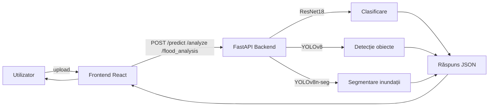
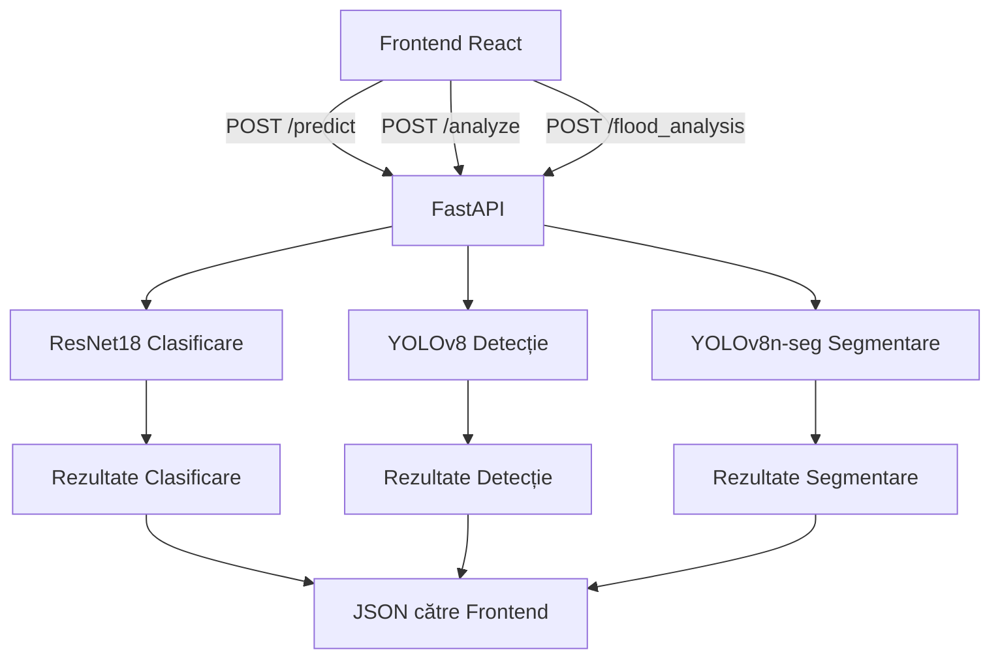

# Raport de cercetare: Sistem AI pentru detectarea și analiza dezastrelor naturale

Autor: Nicanor Mihăilă  
Data: 1 februarie 2026

## Rezumat

Acest raport prezintă dezvoltarea unei aplicații complete pentru detectarea și analiza dezastrelor naturale din imagini statice, integrând trei capacități principale: (1) clasificarea tipului de dezastru (ex. inundație, incendiu de vegetație, ciclon, cutremur, accident rutier), (2) detecția obiectelor relevante din scene generale pentru estimarea impactului (vehicule, persoane, clădiri, vegetație), și (3) segmentarea semantică a zonelor inundate, cu indicatori cantitativi. Arhitectura aplicației cuprinde un backend FastAPI, modele de învățare automată antrenate și/sau fine-tunate (ResNet18 pentru clasificare, YOLOv8 pentru detecție și segmentare), respectiv un frontend web (React + Vite + TailwindCSS) pentru interacțiune cu utilizatorul.

Rezultatele obținute indică un comportament stabil în clasificare, cu timpi de inferență adecvați pentru utilizare interactivă, precum și metrici solide în sarcina de segmentare a inundațiilor (mAP + recall), conform jurnalelor de antrenare generate de YOLOv8. Sistemul oferă atât feedback calitativ (eticheta scenei), cât și estimări cantitative (procent din imagine acoperit de obiecte, suprafață inundată estimată, număr de entități identificate), utile pentru o analiză practică.

## 1. Introducere

Dezastrele naturale produc efecte semnificative asupra comunităților și infrastructurii. Analiza imaginilor poate susține evaluarea rapidă a situației, prioritizarea intervențiilor și comunicarea în timp real. Având la dispoziție colecții de imagini etichetate pentru diverse tipuri de dezastre, precum și dataset-uri orientate pe inundații, am proiectat un sistem capabil să parcurgă întregul flux: preluarea imaginilor de la utilizator, preprocesare, inferență cu modele de viziune computerizată, agregarea rezultatelor și prezentarea lor într-o interfață prietenoasă.

Scopul proiectului a fost să construiască o aplicație modulară, extensibilă și ușor de utilizat, care să combine:
- clasificarea globală a scenei (identificarea tipului de dezastru);
- detecția obiectelor și estimări simple de acoperire / impact;
- segmentarea semantică specifică pentru fenomenul de inundație.

## 2. Context și obiective

Obiectivele tehnice majore au fost:
- crearea unui model de clasificare pe baza arhitecturii ResNet18, antrenat pe dataset-ul „Natural Disasters” pentru etichete sintetice (Flood, Wildfire, Cyclone, Earthquake, Car Crash);
- utilizarea unui model YOLOv8 pre-antrenat pentru detecție generică de obiecte, adaptat la Open Images V7 (OIV7), în sprijinul estimărilor de impact (număr de persoane/vehicule, dimensiuni aproximative pentru suprafețe acoperite de obiecte);
- pregătirea și antrenarea unui model YOLOv8n-seg pentru segmentarea semantică a zonelor de inundație pe baza dataset-ului „Flood Amateur Video for Semantic Segmentation Dataset”, inclusiv conversia măștilor color în formatul YOLO segmentation;
- realizarea unui backend REST robust, bazat pe FastAPI, care expune endpoint-uri de încărcare, predicție, analiză și raportare;
- proiectarea unui frontend care structurează experiența utilizatorului: încărcare imagine, vizualizare rezultate, detalii analitice.

## 3. Date și preprocesare

### 3.1 Dataset-ul „Natural Disasters”

Setul de date „Natural Disasters” este organizat în directoarele `train`, `valid` și `test` ([Datasets/Natural Disasters/](Datasets/Natural%20Disasters/)) cu clase separate (Flood, Wildfire, Cyclone, Earthquake, Car Crash). Acesta este folosit pentru antrenarea modelului de clasificare (ResNet18) în [model/train.py](model/train.py) și pentru testare în [test_api.py](test_api.py). Imaginile sunt standardizate prin redimensionare la (224, 224) și normalizare pe canale conform statisticilor ImageNet.

Transformările folosite consistent în proiect sunt:
- redimensionare la 224x224;
- conversie la tensor;
- normalizare cu medie [0.485, 0.456, 0.406] și deviație standard [0.229, 0.224, 0.225].

Aceste transformări sunt definite în cod atât pentru antrenare ([model/train.py](model/train.py)), cât și pentru inferență ([app.py](app.py), [model/predict.py](model/predict.py)).

### 3.2 Dataset-ul „Flood Amateur Video for Semantic Segmentation”

Pentru segmentarea semantică a inundațiilor, se folosește dataset-ul [Datasets/Flood Amateur Video for Semantic Segmentation Dataset/flood_dataset](Datasets/Flood%20Amateur%20Video%20for%20Semantic%20Segmentation%20Dataset/flood_dataset), care conține imagini și adnotări sub formă de măști color per cadru/video. Fișierul [model/prepare_flood_dataset.py](model/prepare_flood_dataset.py) convertește automat măștile RGB în etichete de clasă, extrage poligoanele pentru fiecare clasă și generează fișierele `labels/*.txt` în format YOLO segmentation, concomitent cu copierea imaginilor în `images/train/` în noul dataset `flood_yolo`.

Clasele utilizate în segmentarea de inundații (maparea culori → clase) sunt: `['flood', 'building', 'plant', 'person', 'vehicle', 'sky']`. După conversie, se produce fișierul `data.yaml` ([Datasets/flood_yolo/data.yaml](Datasets/flood_yolo/data.yaml)) cu configurația pentru antrenarea YOLOv8n-seg.

### 3.3 Setul de fine-tuning

Pentru îmbunătățirea modelului de clasificare, se folosește un set suplimentar de imagini în [fine_tune_images/](fine_tune_images/) cu aceeași structură de clase ca în modelul inițial. Scriptul [fine_tune.py](fine_tune.py) aplică fine-tuning pe rețeaua ResNet18, cu un `learning rate` crescut (0.0001) și un număr de epoci extins (10), păstrând transformările standard.

## 4. Metodologie și modele

### 4.1 Clasificare dezastru: ResNet18

Modelul de clasificare este implementat în [model/train.py](model/train.py) pe baza arhitecturii ResNet18, încărcată cu ponderi pre-antrenate pe ImageNet. Capul de clasificare (`model.fc`) este înlocuit cu un strat liniar care produce un vector de probabilități pe cele 5 clase ale dataset-ului „Natural Disasters”. Optimizarea se face cu Adam (`lr=0.001`), pierderea este `CrossEntropyLoss`, iar antrenarea rulează pe 5 epoci cu loturi de 32. Selectarea câștigătorului (best model) se face pe baza acurateții de validare, iar checkpoint-ul salvat conține starea modelului, lista claselor și acuratețea (`disaster_model.pth`).

Inferența este realizată în [app.py](app.py) și [model/predict.py](model/predict.py). În backend, la endpoint-urile `/predict` și `/file_api`, imaginea este preprocesată și trecută prin ResNet18. Sistemul returnează clasa cu probabilitatea maximă, probabilitățile pentru toate clasele și în cazul `/file_api`, varianta imaginii codificată base64 pentru afișare în frontend.

### 4.2 Detecție obiecte: YOLOv8 (OIV7)

Pentru detecție s-a ales YOLOv8 în varianta ușoară (`yolov8n-oiv7.pt`), pre-antrenată pe Open Images V7. Alegerea YOLOv8 este justificată de:
- performanța solidă per parametru (rapid, cu acuratețe bună pentru utilizare interactivă);
- suport nativ în biblioteca Ultralytics;
- portabilitate bună pe CPU și pe dispozitive Apple (MPS), cu latențe rezonabile.

Endpoint-ul `/analyze` din [app.py](app.py) rulează detecția pe imaginea încărcată și colectează:
- lista de cutii (`boxes`), inclusiv id-urile de clasă și numele claselor;
- numărul de persoane și vehicule (prin filtrare după id-uri relevante);
- o estimare simplă a suprafeței acoperite de obiecte în raport cu suprafața imaginii (procent), calculată din suma ariilor cutiilor normalizată la dimensiunea imaginii;
- o estimare brută a suprafeței acoperite (m²) folosind o mapare euristică din id de clasă către aria medie (hărți de arie în [app.py](app.py)).

Această analiză furnizează o primă aproximație privind densitatea scenei (obiecte, oameni, vehicule), utilă în evaluări rapide post-dezastru.

### 4.3 Segmentare semantică: YOLOv8n-seg (inundații)

Pentru fenomenul de inundație, s-a antrenat un model YOLOv8n-seg pe dataset-ul generat automat în [model/prepare_flood_dataset.py](model/prepare_flood_dataset.py). Antrenarea este orchestrată în [model/train_flood_yolo.py](model/train_flood_yolo.py) cu parametrii: `epochs=50`, `imgsz=640`, `batch=8`, `device='cpu'` (utilizatorul poate comuta pe `mps` dacă este disponibil).

Modelul rezultat (`runs/segment/flood_seg/weights/best.pt`) este integrat în backend la endpoint-ul `/flood_analysis`, unde se calculează:
- `flood_area_percent`: procentul de pixeli al mascatelor de clasă „flood” raportat la aria imaginii;
- `flood_area_m2`: o estimare simplificată, proporțională cu `flood_area_percent` (calibrarea poate fi rafinată ulterior cu metadate de rezoluție spațială);
- număr de entități detectate pe clase (building, vehicle, person, plant);
- totalul obiectelor identificate.

Această componentă completează clasificarea globală cu un nivel de granularitate necesar în evaluarea efectivă a impactului unei inundații.

## 5. Backend: arhitectură și fluxuri

Backend-ul este realizat cu FastAPI în [app.py](app.py), unde se instanțiază aplicația, se configurează CORS și se încarcă modelele (ResNet18 pentru clasificare, YOLOv8 pentru detecție și YOLOv8n-seg pentru segmentare inundații). Principalele endpoint-uri:

- `POST /file_api`: primește fișier imagine, rulează clasificarea cu ResNet18 și salvează rezultatul într-o zonă de memorie (`file_api_results`) împreună cu imaginea base64; răspunsul conține clasa, probabilitățile și imaginea;
- `GET /file_api_results`: returnează ultimul rezultat stocat prin `file_api`, folosit de frontend pentru afișare fără reîncărcare;
- `POST /predict`: clasificare clasică (clasă + probabilități) fără stocarea imaginii în sistem;
- `POST /analyze`: detecție obiecte cu YOLOv8, numărări de entități, estimări de acoperire și raport al claselor detectate;
- `POST /flood_analysis`: segmentare semantică cu YOLOv8n-seg, procent de inundație, estimare de suprafață și număr de obiecte pe clase;
- `GET /`: endpoint de stare (health-check), întoarce informații minime despre aplicație.

Fluxul general de procesare pentru o imagine încărcată poate fi schițat astfel:



Structura internă a endpoint-urilor din [app.py](app.py) urmează un tipar clar: citirea fișierului (`UploadFile`), preprocesare (PIL → tensor), inferență (`torch.no_grad()`), agregare rezultate, construirea răspunsului JSON.

## 6. Frontend: integrare și interfață

Frontend-ul este implementat în [frontend/](frontend/) folosind React + Vite, stilizat cu TailwindCSS. Componenta principală ([frontend/src/App.jsx](frontend/src/App.jsx)) permite:
- încărcarea fișierelor imagine și previzualizare;
- trimiterea cererilor către backend pentru clasificare (`/predict`), detecție (`/analyze`) și segmentare inundații (`/flood_analysis`);
- afișarea rezultatelor sub formă de carduri și bare de probabilitate.

Serviciile de acces la backend sunt definite în [frontend/src/services/api.js](frontend/src/services/api.js), incluzând utilitare pentru interogarea endpoint-ului `file_api_results` (polling). Există componente de UI reutilizabile în [frontend/src/components/](frontend/src/components/), precum `ImageUpload.jsx` (gestionarea încărcării și previzualizării) și `ResultDisplay.jsx` (afișarea etichetelor și a probabilităților). Pentru testări rapide fără UI complex, există o pagină simplă în [frontend_api/index.html](frontend_api/index.html) care face `fetch` direct către endpoint-ul `file_api`.

## 7. Antrenare, fine-tuning și rezultate

### 7.1 Clasificare (ResNet18)

Antrenarea inițială (în [model/train.py](model/train.py)) folosește `pretrained=True` pentru ResNet18, cu înlocuirea stratului final pentru cele 5 clase. Optimizarea: Adam (`lr=0.001`), epoci: 5, `batch_size=32`. Dispozitiv de rulare: `mps` pe macOS (dacă disponibil), altfel `cpu`. Pe parcurs, se calculează acuratețea de antrenare și validare, iar cel mai bun model este salvat în `disaster_model.pth`. Inferența se bazează pe Softmax și alegerea indicelui cu probabilitate maximă.

Scriptul de fine-tuning ([fine_tune.py](fine_tune.py)) pornește de la `model/disaster_model.pth`, păstrează structura claselor, ridică `learning rate` la 0.0001 și extinde antrenarea la 10 epoci pe imagini colectate suplimentar (directoarele din [fine_tune_images/](fine_tune_images/)). Se salvează un backup (`disaster_model_backup.pth`) și apoi se scrie noul model în `model/disaster_model.pth`. Recomandarea este repornirea serverului pentru a încărca noul checkpoint.

### 7.2 Segmentare (YOLOv8n-seg)

Antrenarea pentru segmentarea inundațiilor se realizează cu YOLOv8n-seg prin [model/train_flood_yolo.py](model/train_flood_yolo.py), folosind configurarea `data.yaml` din [Datasets/flood_yolo/data.yaml](Datasets/flood_yolo/data.yaml). Jurnalele de antrenare sunt salvate în [runs/segment/flood_seg/](runs/segment/flood_seg/), inclusiv `args.yaml`, `results.csv` și `weights/best.pt`.

Din [runs/segment/flood_seg/results.csv](runs/segment/flood_seg/results.csv) se pot extrage indicatori de performanță în timp (per epocă), precum:
- `metrics/mAP50(M)` și `metrics/mAP50-95(M)` pentru segmentare (Măști);
- `metrics/precision(M)`, `metrics/recall(M)`;
- pierderi de antrenare și validare pe componente (`train/seg_loss`, `val/seg_loss`, etc.).

Exemplificativ, valorile înregistrate (epoci multiple) indică mAP50(M) de peste 0.90 în anumite momente ale antrenării, cu recall (M) apropiat de 1.00 pe subsetul de validare utilizat, sugerând o capacitate bună de segmentare pentru clasele definite. Această performanță trebuie interpretată în contextul dataset-ului, split-urilor folosite și eventualelor configurații de augmentare.

### 7.3 Detecție (YOLOv8n-OIV7)

Modelul de detecție folosit în [app.py](app.py) (`yolov8n-oiv7.pt`) permite identificarea unui număr mare de clase generale din imagini. Pentru scopul aplicației, sunt folosite clase sugestive (persoane, vehicule, clădiri, vegetație), iar calculul procentului de acoperire se bazează pe suma ariilor cutiilor detectate raportată la aria imaginii. În plus, se afișează numărători pe clase (ex. câte persoane/vehicule apar în scenă). Aceste estimări sunt euristice și pot fi rafinate ulterior prin calibrare specifică domeniului.

## 8. Designul aplicației și integrarea componentelor

Sistemul urmează o arhitectură separată pe straturi: UI (frontend), API (backend), modele (clasificare/detecție/segmentare). Interacțiunea se face exclusiv prin endpoint-uri HTTP, cu date în format JSON. Preprocesarea imaginilor se face uniform (PIL → transformări Torch) pentru clasificare; YOLOv8 lucrează direct cu imagini `PIL.Image` sau `NumPy`.

O schemă a componentelor principale:



Endpoint-ul `file_api` deservește un caz de utilizare în care imaginea și rezultatul sunt stocate temporar și pot fi preluate ulterior de UI prin `GET /file_api_results`, facilitând fluxuri de tip „upload → vizualizează” fără re-trimiterea fișierului.

## 9. Evaluare și discuții

Evaluarea formală a modelului de clasificare a fost axată pe acuratețea de validare, stocată în checkpoint. Pentru o analiză completă, se recomandă calculul unei matrice de confuzie, F1-score și mAP pentru detecție/segmentare, pe subsete standardizate. Totuși, `results.csv` din YOLOv8n-seg indică evoluții bune ale mAP-ului pe măști, iar detecția generică oferă o acoperire adecvată pentru clasele de interes.

Limitările curente:
- Lipsa calibrării spațiale: estimarea `flood_area_m2` este proporțională cu procentul de pixeli și presupune o conversie simplă (ex. 1% ≈ 100 m²), fără informație geografică reală;
- Maparea euristică pentru „aria medie per obiect” în detecție poate induce erori sistematice și necesită validare în teren;
- Dependință de distribuția dataset-ului: imagini din `Natural Disasters` pot avea biasuri, iar generalizarea la alte seturi poate fi limitată;
- Rularea pe CPU implică latențe mai mari pentru YOLOv8n-seg; folosirea `mps` sau GPU dedicat ar reduce timpii.

## 10. Lucrări viitoare

Direcții de extindere:
- Integrarea unor modele de segmentare dedicate (ex. Segment Anything + măști adaptate) pentru fenomene diverse;
- Calibrarea estimării suprafețelor prin meta-date (rezoluții, altitudine, informații GIS);
- Introducerea augmentărilor avansate la antrenare (mixup, mosaic, color jitter) și regularizări pentru robustețe;
- Colectarea unui dataset curat de validare, cu etichete verificate, pentru metrici replicabile;
- Jurnalizare extinsă (prometheus + grafana) pentru observabilitate și profiling;
- API pentru procesare batch și export rapoarte PDF/CSV.

## 11. Concluzii

Proiectul demonstrează o integrare coerentă între clasificarea scenei, detecția obiectelor și segmentarea inundațiilor, într-un cadru backend–frontend simplu de folosit. Alegerea ResNet18 pentru clasificare oferă un compromis bun între performanță și timp de inferență; YOLOv8 completează cu detecții utile pentru estimări de impact, iar YOLOv8n-seg asigură localizarea precisă a zonelor inundate. Arhitectura modulată permite extinderea rapidă către alte fenomene sau schimbarea ușoară a modelelor, menținând coerența la nivel de API.

## 12. Instrucțiuni de rulare (opțional)

### 12.1 Backend

1. Instalare dependențe (exemplu minimal):

```bash
pip install fastapi uvicorn torch torchvision ultralytics pillow
```

2. Pornire server:

```bash
uvicorn app:app --reload
```

### 12.2 Frontend

1. Instalare dependențe în [frontend/](frontend/):

```bash
cd frontend
npm install
npm run dev
```

2. Accesare interfață în browser (vite dev server) și trimitere imagini către `http://127.0.0.1:8000`.

### 12.3 Antrenare segmentare (YOLOv8n-seg)

```bash
python3 model/prepare_flood_dataset.py
python3 model/train_flood_yolo.py
```

După antrenare, backend-ul va folosi automat modelul din [runs/segment/flood_seg/weights/best.pt](runs/segment/flood_seg/weights/best.pt).

## 13. Referințe la implementare

- Backend: [app.py](app.py)
- Clasificare & inferență: [model/train.py](model/train.py), [model/predict.py](model/predict.py)
- Fine-tuning clasificare: [fine_tune.py](fine_tune.py), [model/disaster_model.pth](model/disaster_model.pth)
- Segmentare inundații: [model/prepare_flood_dataset.py](model/prepare_flood_dataset.py), [Datasets/flood_yolo/data.yaml](Datasets/flood_yolo/data.yaml), [model/train_flood_yolo.py](model/train_flood_yolo.py), [runs/segment/flood_seg/weights/best.pt](runs/segment/flood_seg/weights/best.pt)
- Frontend: [frontend/src/App.jsx](frontend/src/App.jsx), [frontend/src/services/api.js](frontend/src/services/api.js), [frontend/src/components/ImageUpload.jsx](frontend/src/components/ImageUpload.jsx), [frontend/src/components/ResultDisplay.jsx](frontend/src/components/ResultDisplay.jsx)

---

Anexă: Eșantion de rezultate YOLOv8n-seg (din `results.csv`), ilustrând evoluția mAP50(M), recall(M) și pierderile per epocă. Valorile ridicate de `metrics/mAP50(M)` (ex. >0.90) sugerează o capacitate bună de segmentare pe dataset-ul curent, în acord cu obiectivele de detectare a zonelor de inundație.
